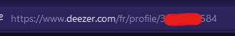

# Metadata

Your theme needs a name, a description, etc. All this info goes inside a comment block which **must** be at the top
of your CSS file.

## Tags

### ``name``

Your theme name.

### ``description``

A few words explaining your theme.

### ``screenshot``

A link to your theme screenshot.

### ``author``

Your username.

### ``authorId``

Your **Deezer** user ID. You can get this by going to Deezer in your browser, going to your profile (not your account or
settings), then copying the numbers in the URL. For example, mine is 3...584 (hid the numbers because of privacy).



## Example

```css
/**
 * @name MyTheme
 * @description This is my theme.
 * @screenshot https://a-link.to/my/theme/screenshot
 * @author User
 * @authorId 12345678
 */

...
```

Other tags will be supported in the future.
